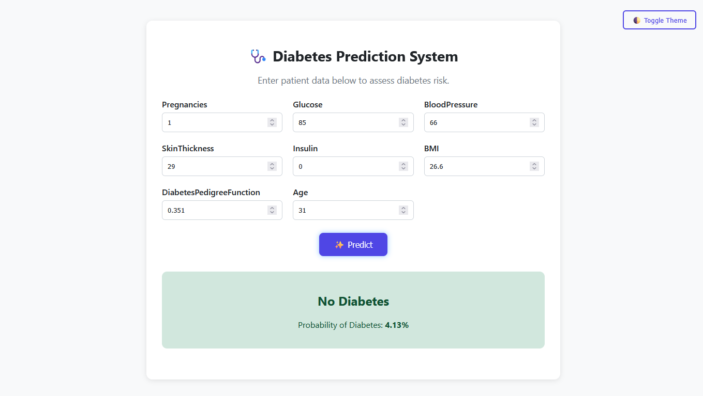
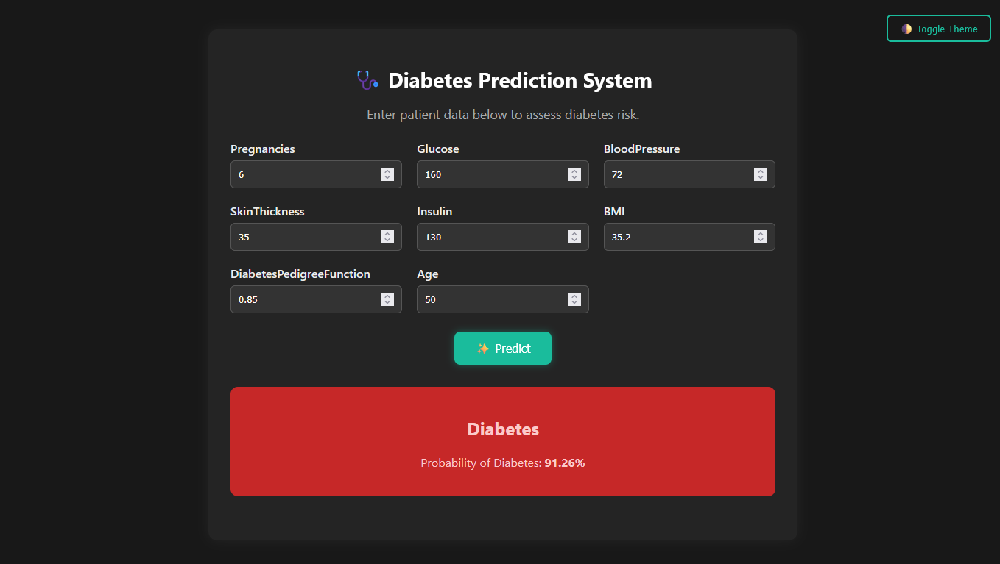

## 🩺 Diabetes Prediction Web Application

### 🔬 Machine Learning + Flask + Responsive UI

•  **Tech Stack:** Python, Flask, scikit-learn, HTML/CSS, Chart.js

---

### 📌 Project Overview

This is a **Diabetes Prediction System** developed using a machine learning model trained on the **PIMA Indians Diabetes Dataset**. The system allows users to enter health-related metrics to predict the **likelihood of having diabetes**, along with a confidence percentage.

The project features a **modern UI** with **dark/light mode toggle**, **responsive design**, and input validation. It is deployed as a **Flask web app** and is easily extendable for future enhancements (such as database integration, REST APIs, and user authentication).

---

### 🎯 Key Features

✅ **Real-time Diabetes Prediction**
✅ **Displays Probability Confidence (%)**
✅ **User-friendly Interface (Dark/Light Mode)**
✅ **Responsive Layout (Desktop & Mobile)**
✅ **Chart.js Visual (Optional)**
✅ **Reusable Codebase for Healthcare Apps**
✅ **Well-structured & Documented Project**

---

### 🧪 How the Prediction Works

This app uses a **trained scikit-learn classifier** (Logistic Regression/Random Forest/etc.) to analyze 8 medical features:

| Feature                  | Description                                    |
| ------------------------ | ---------------------------------------------- |
| Pregnancies              | Number of pregnancies                          |
| Glucose                  | Plasma glucose concentration                   |
| BloodPressure            | Diastolic blood pressure (mm Hg)               |
| SkinThickness            | Triceps skin fold thickness (mm)               |
| Insulin                  | 2-Hour serum insulin (mu U/ml)                 |
| BMI                      | Body Mass Index (weight in kg/(height in m)^2) |
| DiabetesPedigreeFunction | A function representing diabetes pedigree      |
| Age                      | Patient age in years                           |

---

### 🛠️ How to Run This Project

Follow these steps to set up and run the **Diabetes Prediction Web App** on your local machine:

---

#### ✅ Prerequisites

Make sure you have:

- ✅ Python 3.8 or higher installed
- ✅ `pip` installed
- ✅ Git (optional, for cloning the repo)

---

#### 📥 1. Clone the Repository

```bash
git clone https://github.com/yourusername/diabetes_app.git
cd diabetes_app
```

> 📌 Or download the ZIP and extract it manually if you prefer.

---

#### 🧪 2. Create and Activate a Virtual Environment

**On Windows:**

```bash
python -m venv venv
venv\Scripts\activate
```

**On macOS/Linux:**

```bash
python3 -m venv venv
source venv/bin/activate
```

---

#### 📦 3. Install Required Packages

```bash
pip install -r requirements.txt
```

> 📂 The `requirements.txt` file includes:
>
> - Flask
> - pandas
> - numpy
> - scikit-learn
> - joblib

---

#### 🚀 4. Run the Flask App

```bash
python app.py
```

---

#### 🌐 5. Open the App in Your Browser

Go to:

```
http://127.0.0.1:5000/
```

> You will see the prediction form. Fill in the input values and hit **Predict**.

---

#### 🧪 Example Test Input

Use this sample to test if the app is working correctly:

```txt
Pregnancies: 3
Glucose: 130
BloodPressure: 70
SkinThickness: 28
Insulin: 100
BMI: 31.5
DiabetesPedigreeFunction: 0.5
Age: 42
```

> ✅ Expected Result: Likely **No Diabetes**
> ✅ The system also displays **confidence %** and adapts to **dark/light theme**.

---

### 🖼️ Interface Preview

#### ☀️ Light Mode | 🌙 Dark Mode

| No Diabetes Prediction                     | Diabetes Prediction                          |
| ------------------------------------------ | -------------------------------------------- |
|  |  |

---

### 💻 Technologies Used

| Category            | Tools                                           |
| ------------------- | ----------------------------------------------- |
| **Frontend**        | HTML5, CSS3, Chart.js                           |
| **Backend**         | Flask (Python)                                  |
| **Modeling**        | Scikit-learn, Pandas, NumPy, Joblib             |
| **Styling**         | Responsive Grid Layout, Light/Dark Theme Toggle |
| **Version Control** | Git & GitHub                                    |

---

### ⚙️ Installation & Running Locally

```bash
# 1. Clone this repository
git clone https://github.com/yourusername/diabetes_app.git
cd diabetes_app

# 2. Create virtual environment
python -m venv venv
source venv/bin/activate      # macOS/Linux
venv\Scripts\activate         # Windows

# 3. Install dependencies
pip install -r requirements.txt

# 4. Launch the Flask app
python app.py

# 5. Open your browser
# Navigate to: http://127.0.0.1:5000/
```

---

### 🧬 Example Input Values

Try the following test inputs in the form to simulate a prediction:

```txt
Pregnancies: 6
Glucose: 145
BloodPressure: 72
SkinThickness: 35
Insulin: 125
BMI: 33.6
DiabetesPedigreeFunction: 0.63
Age: 45
```

> 🔍 **Expected Result:** `Diabetes` with \~80–90% confidence

---

### 📁 Project Structure

```
diabetes_app/
│
├── static/                   # CSS files
│   ├── light.css
│   └── dark.css
│
├── templates/                # Jinja2 HTML templates
│   └── index.html
│
├── diabetes_prediction_model.joblib  # Pre-trained ML model
├── app.py                    # Flask application
├── requirements.txt
├── .gitignore
├── README.md
└── screenshots/              # Interface snapshots
    ├── Yesdiabetes.png
    └── Nodiabetes.png
```

---

### 🚀 Deployment Ideas

You can deploy this project using:

- **Render / Railway / Replit (Free hosting options)**
- **Dockerize for scalability**
- **Add database support (SQLite/PostgreSQL)**
- **Extend with user authentication or history tracking**

---

### 🤝 Why This Project Matters

- Demonstrates **end-to-end AI system development**.
- Great portfolio piece for **Data Science, Machine Learning, and Web Development** roles.
- Highlights UI/UX sensibility alongside technical skill.
- Can be expanded into a **clinical decision support system**.

---

### 📌 Future Improvements

- 📊 Add historical tracking with SQLite
- 🧾 Export reports as PDF
- 🌐 Deploy publicly using Render or HuggingFace Spaces
- 🔒 Add user login system

---

### 🧠 Learnings & Skills Gained

✅ Flask Routing & Forms
✅ ML Model Integration into Web App
✅ CSS Theming and User Experience
✅ Frontend-Backend Data Binding
✅ Input Validation & Error Handling

---

### 📄 License

This project is licensed under the [MIT License](LICENSE).
